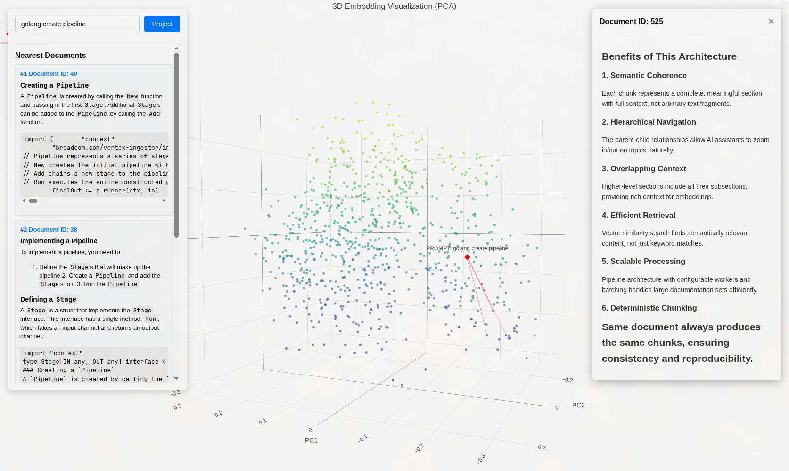

# Vectree

[](https://github.com/niedch/vectree/actions/workflows/go.yaml)

Package your knowledge base as a Docker image. Vectree ingests documentation from websites, GitHub repos, and local markdown files, chunks them, generates embeddings, and serves everything through an MCP server — all self-contained in a single portable image.

```
Sources ──▶ Ingest ──▶ Chunk ──▶ Embed ──▶ SQLite DB ──▶ MCP Server
```

Share your image. Anyone can pull it and query your docs with natural language.

---

## Embedding Visualizer

An interactive 3D visualization of your ingested embeddings using PCA dimensionality reduction. Type a natural language prompt to project it into the embedding space and see the nearest matching documents.



```bash
vectree visualize --port 8090 --limit 1000
```

| Flag | Default | Description |
|---|---|---|
| `--port` / `-p` | `8090` | Port for the web server |
| `--limit` / `-l` | `1000` | Maximum number of embeddings to visualize |

---

## Sources

Sources define what knowledge goes into your container. Every source is a named config block.

### HTTP

Crawl a website for documentation. Configure crawl depth and a CSS selector to extract content.

```toml
[sources.gemini-docs]
type = "http"
url = "https://ai.google.dev/gemini-api/docs"
max_depth = 3
selector = ".devsite-article-body"
```

### GitHub

Clone a repository to ingest markdown docs, wikis, or inline documentation.

```toml
[sources.vectree-docs]
type = "github"
repo = "https://github.com/niedch/vectree"
branch = "main"             # optional, defaults to default branch
token = "ghp_..."           # optional, falls back to GITHUB_TOKEN env
subdir = "docs"             # optional, limit to a subdirectory
```

### Markdown

Load local `.md` files from a directory — perfect for Obsidian vaults or local notes.

```toml
[sources.obsidian-vault]
type = "markdown"
location = "/vault/personal/"
```

---

## MCP Server

Once running, the server exposes these tools:

| Tool | Description |
|---|---|
| `search-documentation` | Semantic search across your knowledge base. Provide a `search-string` and get the most relevant chunks. |
| `get-parent-context` | Get the parent section of a document chunk for broader context. Pass a `document-id`. |

### Built-in Prompts

Prompts in the configured `[prompts]` directory are registered as MCP prompts. The default set includes:

| Prompt | Description |
|---|---|
| `documentation-help` | Ask about docs, features, or configuration |
| `documentation-develop` | Find developer docs and API guides |

---

## Configuration

Everything lives in `config.toml`. Here's a fully annotated example:

```toml
# --- Sources ---
# One or more named sources. Each has a type and type-specific fields.
[sources.vectree-docs]
type = "github"
repo = "https://github.com/niedch/vectree"

[sources.gemini-docs]
type = "http"
url = "https://ai.google.dev/gemini-api/docs"
max_depth = 3
selector = ".devsite-article-body"

[sources.obsidian-vault]
type = "markdown"
location = "../obsidian-vault/"

# --- AI Provider ---
# Which API to use for generating embeddings.
[ai]
provider = "gemini"              # gemini | openai | ollama
embedding_model = "gemini-embedding-001"
# api_key = "..."                # or set GEMINI_API_KEY / OPENAI_API_KEY env var
# vertex_size = 3072             # vector dimension for the vec0 table
# url = "..."                    # custom endpoint for openai / ollama

# --- Chunking ---
# How to split documents before embedding.
[chunking]
strategy = "mdast"               # mdast | header | line

# --- Pipeline ---
# Parallelism and batch sizes for the ingestion pipeline.
[pipeline]
embedder_batch_size = 64
embedder_workers = 8
store_batch_size = 64
crawler_workers = 8

# --- Database ---
# SQLite connection string.
[database]
connection_string = "kownledgebase.db?cache=shared&mode=rw"

# --- Retrieval ---
# How many results to return from a search query.
[retrieval]
similarity_results = 3

# --- Prompts ---
# Directory containing .prompt files (dotprompt format) for MCP prompts.
[prompts]
path = "./prompts"
```

### Environment Variables

| Variable | Config Key |
|---|---|
| `GEMINI_API_KEY` | `ai.gemini_api_key` |
| `OPENAI_API_KEY` | `ai.openai_api_key` |
| `GITHUB_TOKEN` | used by github sources as fallback |

Any config key can also be overridden with an env var (e.g. `AI_PROVIDER=ollama`).

---

## Quickstart

1. Create a `config.toml` with your sources:

```toml
[sources.my-docs]
type = "markdown"
location = "./docs/"
```

2. Build the image (ingestion runs at build time):

```bash
docker build -t my-knowledge-base .
```

3. Run the MCP server:

```bash
docker run -i --init my-knowledge-base
```

4. Connect any MCP client (Claude Desktop, Zed, etc.) to the stdio server.

---

## Development

### Commands

| Command | Description |
|---|---|
| `vectree ingest` | Ingest all sources, generate embeddings, store in SQLite |
| `vectree ingestDebug` | Ingest and dump chunks as `output/output_N.md` without embedding |
| `vectree visualize` | Start the 3D embedding visualization web server |
| `vectree mcp` | Start the MCP server over stdio |
