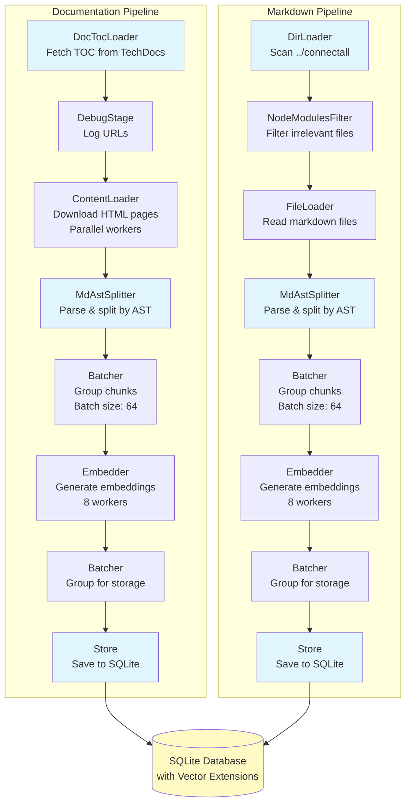

# ConnectAll Documentation RAG System

A high-performance document ingestion and Retrieval-Augmented Generation (RAG) system for ConnectAll documentation. 
This tool enables AI assistants to search and retrieve relevant documentation using semantic search powered by vector embeddings.

## Features

- **Dual-Source Ingestion**: Processes both web-based documentation and local markdown files
- **Semantic Search**: Uses Google Gemini embeddings for intelligent document retrieval
- **MCP Server**: Exposes documentation search via the Model Context Protocol (MCP)
- **Pipeline Architecture**: Efficient parallel processing with configurable workers and batch sizes
- **Vector Database**: SQLite with vector extensions for fast similarity search
- **Header-Based Chunking**: Maintains semantic coherence in document splits

## Architecture

### Ingestion Pipeline

The system runs two parallel ingestion pipelines:

1. **Documentation Pipeline**:
   - Fetches table of contents from Broadcom TechDocs
   - Downloads all linked documentation pages
   - Processes HTML content into text chunks
   - Generates embeddings for each chunk

2. **Markdown Pipeline**:
   - Scans local markdown files in the ConnectAll repository
   - Filters out irrelevant files (node_modules, etc.)
   - Splits documents using header-based chunking
   - Generates embeddings for each section



### MdAst Splitter

The **MdAst Splitter** is a custom markdown processing stage that intelligently splits documents while preserving semantic context. Unlike simple line-based or character-count splitters, it uses an Abstract Syntax Tree (AST) approach to understand document structure.

#### How It Works

The MdAst Splitter operates in three phases:

1. **Lexical Analysis (Tokenization)**
   - Scans the markdown document line-by-line
   - Identifies headings (1-6 levels) by detecting `#` prefixes
   - Classifies content as heading, text, or blank lines
   - Produces a stream of tokens with type and metadata

2. **Parsing (AST Construction)**
   - Converts tokens into a hierarchical tree structure
   - Creates typed nodes: `DocumentNode`, `HeadingNode`, `ParagraphNode`, `TextNode`
   - Maintains parent-child relationships between sections
   - Preserves heading levels and content hierarchy

3. **Section Extraction**
   - Traverses the AST to identify all headings
   - For each heading, creates a self-contained section that includes:
     - The heading itself
     - All immediate content (paragraphs, code blocks, etc.)
     - All subheadings and their content
   - Stops when encountering a heading of equal or higher level

#### Benefits

- **Semantic Coherence**: Each chunk is a complete, meaningful section with context
- **Hierarchical Context**: Subheadings remain grouped with their parent sections
- **No Orphaned Content**: Content is never split mid-paragraph or mid-section
- **Optimal for RAG**: Embeddings capture complete concepts rather than arbitrary text fragments
- **Deterministic**: Same document always produces the same chunks

#### Example

Given this markdown:

```markdown
# Database Setup
Instructions for setting up the database.

## PostgreSQL
Install PostgreSQL first.

### Configuration
Edit the config file.

## MySQL
Alternative database option.
```

The MdAst Splitter produces these sections:

**Section 1:**
```markdown
# Database Setup
Instructions for setting up the database.

## PostgreSQL
Install PostgreSQL first.

### Configuration
Edit the config file.

## MySQL
Alternative database option.
```

**Section 2:**
```markdown
## PostgreSQL
Install PostgreSQL first.

### Configuration
Edit the config file.
```

**Section 3:**
```markdown
### Configuration
Edit the config file.
```

**Section 4:**
```markdown
## MySQL
Alternative database option.
```

Each section maintains its hierarchical context, making it ideal for semantic search and retrieval.

### MCP Server

The MCP server provides:
- `search-documentation` tool for semantic search
- Pre-built prompts for common use cases:
  - `connectall-help`: General help with features and configuration
  - `connectall-troubleshoot`: Troubleshooting assistance
  - `connectall-develop`: Developer documentation search

## Prerequisites

- Go 1.24.2 or later
- Docker (for containerized deployment)
- Google Gemini API key
- GitHub Enterprise API token (for private repository access during build)

## Installation

### Local Development

1. Install dependencies:
```bash
make deps
```

2. Build the binary:
```bash
make build
```

### Docker Build

Build the Docker image with required API keys:

```bash
make docker-build
```

This requires the following environment variables:
- `GITHUB_ENTERPRISE_API_KEY`: Token for accessing the ConnectAll repository
- `GEMINI_API_KEY`: Google Gemini API key for embeddings

## Usage

### MCP Client Configuration

Add this configuration to your MCP client (e.g., Claude Desktop):

```json
{
  "mcpServers": {
    "connectall-doc-rag": {
      "command": "docker",
      "args": [
        "run",
        "-i",
        "--rm",
        "-e",
        "GEMINI_API_KEY",
        "connectall-doc-rag:latest"
      ],
      "env": {
        "GEMINI_API_KEY": "$GEMINI_API_KEY"
      }
    }
  }
}
```

