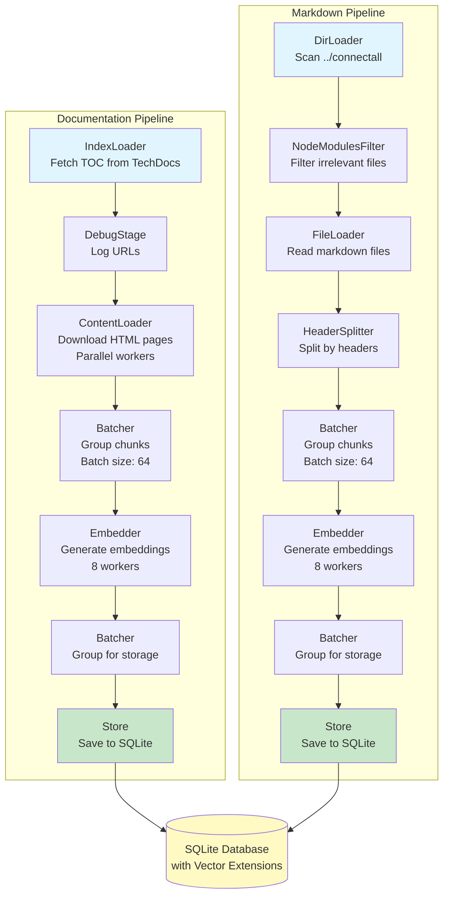

# ConnectAll Documentation RAG System

A high-performance document ingestion and Retrieval-Augmented Generation (RAG) system for ConnectAll documentation. 
This tool enables AI assistants to search and retrieve relevant documentation using semantic search powered by vector embeddings.

## Features

- **Dual-Source Ingestion**: Processes both web-based documentation and local markdown files
- **Semantic Search**: Uses Google Gemini embeddings for intelligent document retrieval
- **MCP Server**: Exposes documentation search via the Model Context Protocol (MCP)
- **Pipeline Architecture**: Efficient parallel processing with configurable workers and batch sizes
- **Vector Database**: SQLite with vector extensions for fast similarity search
- **Header-Based Chunking**: Maintains semantic coherence in document splits

## Architecture

### Ingestion Pipeline

The system runs two parallel ingestion pipelines:

1. **Documentation Pipeline**:
   - Fetches table of contents from Broadcom TechDocs
   - Downloads all linked documentation pages
   - Processes HTML content into text chunks
   - Generates embeddings for each chunk

2. **Markdown Pipeline**:
   - Scans local markdown files in the ConnectAll repository
   - Filters out irrelevant files (node_modules, etc.)
   - Splits documents using header-based chunking
   - Generates embeddings for each section



### MCP Server

The MCP server provides:
- `search-documentation` tool for semantic search
- Pre-built prompts for common use cases:
  - `connectall-help`: General help with features and configuration
  - `connectall-troubleshoot`: Troubleshooting assistance
  - `connectall-develop`: Developer documentation search

## Prerequisites

- Go 1.24.2 or later
- Docker (for containerized deployment)
- Google Gemini API key
- GitHub Enterprise API token (for private repository access during build)

## Installation

### Local Development

1. Install dependencies:
```bash
make deps
```

2. Build the binary:
```bash
make build
```

### Docker Build

Build the Docker image with required API keys:

```bash
make docker-build
```

This requires the following environment variables:
- `GITHUB_ENTERPRISE_API_KEY`: Token for accessing the ConnectAll repository
- `GEMINI_API_KEY`: Google Gemini API key for embeddings

## Usage

### MCP Client Configuration

Add this configuration to your MCP client (e.g., Claude Desktop):

```json
{
  "mcpServers": {
    "connectall-doc-rag": {
      "command": "docker",
      "args": [
        "run",
        "-i",
        "--rm",
        "-e",
        "GEMINI_API_KEY",
        "connectall-doc-rag:latest"
      ],
      "env": {
        "GEMINI_API_KEY": "$GEMINI_API_KEY"
      }
    }
  }
}
```

